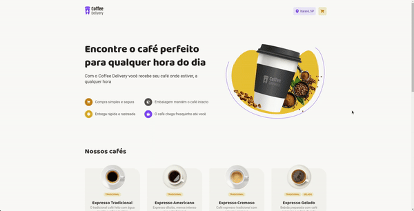

  

## Descrição

Receba em sua casa o melhor café do **MUNDO**. Nessa aplicação é possível comprar os melhores sabores de café que você já experimentou, e pagar da melhor forma que preferir ☕

## Preview de como ficou

  

## Tecnologias utilizadas

- [react](https://github.com/facebook/react) - para desenvolver o frontend web
- [vite](https://github.com/vitejs/vite) - para configurar e otimizar nosso projeto ReactJS
- [styled-components](https://github.com/styled-components/styled-components) - para gerenciar os estilos da aplicação
- [phosphor-react](https://github.com/phosphor-icons/react) - para adicionar icones
- [react-imask](https://github.com/uNmAnNeR/imaskjs/tree/master/packages/react-imask) - para criar uma mascara no input de CEP
- [react-hook-form](https://github.com/react-hook-form/react-hook-form) - para gerenciar e validar nosso formulário de checkout
- [zod](https://github.com/colinhacks/zod) - para criar validações altamente integradas com o TypesScript
- [json-server](https://github.com/typicode/json-server) - para criar um servidor com dados ficticios
- [axios](https://github.com/axios/axios) - para fazer requisições HTTP ao nosso servidor

## Funcionalidades

- [x] **Página inicial**
  - [x] Listagem de cafés (buscados no servidor)
  - [x] Adicionar uma quantidade específicas de cafés no carrinho
- [x] **Checkout**
  - [x] Remover e alterar a quantidades de cafés no carrinho
  - [x] Mostrar a soma dos cafés no carrinho + valor do frete
  - [x] Formulário com validação do endereço (busca o cep nessa [api](https://viacep.com.br/))
- [x] **Finalização da compra**
  - [x] Mostrar dados da entrega
- [x] **Funcionalidades do ReactJS**
  - [x] Contexto do carrinho
  - [x] Alteração de lista
  - [x] useEffect
- [x] **Persistência de dados**
  - [x] ID do cliente no localStorage (necessário para buscar os cafés que estão carrinho salvos no servidor)
  - [x] Salvar ids e quantidade de produtos no servidor
  - [x] Deixar salvo no servidor o endereço de entrega

## Licença

Este projeto está sob os termos da licença [MIT](license)

 

Feito com 💙 por [lhmoreno](https://github.com/lhmoreno)
