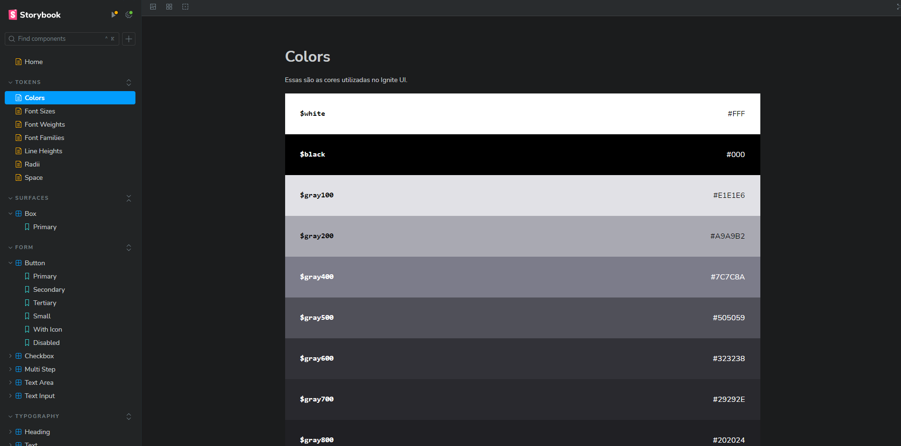

# Design System

## Descrição

Este projeto é um design system documentado por [Storybook](https://github.com/storybookjs/storybook).

## Preview de como ficou

  

## Tecnologias utilizadas

- [ReactJS](https://github.com/facebook/react) - para desenvolver o frontend web
- [Vite](https://github.com/vitejs/vite) - para configurar e otimizar nosso projeto ReactJS
- [TypeScript](https://github.com/microsoft/TypeScript) - para adicionar tipagem ao nosso código javascript
- [Storybook](https://github.com/storybookjs/storybook) - para documenar a UI
- [Turbo Repo](https://github.com/vercel/turbo) - para lidar com os pacotes / padrão de UI.

 

Feito com 💙 por [lhmoreno](https://github.com/lhmoreno)
