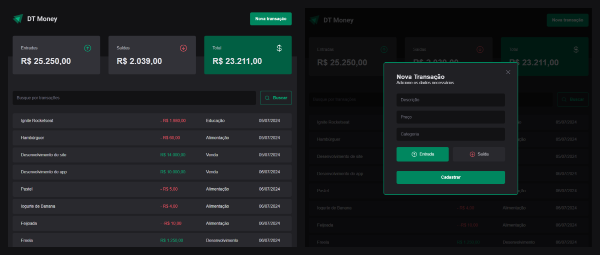

  

## Descrição

Este projeto tem o objetivo de auxiliar no gerenciamento das suas finanças 💵.

## Preview de como ficou

  

## Tecnologias utilizadas

- [ReactJS](https://github.com/facebook/react) - para desenvolver o frontend web
- [react-router-dom](https://github.com/remix-run/react-router) - para lidar com as rotas da aplicação
- [Vite](https://github.com/vitejs/vite) - para configurar e otimizar nosso projeto ReactJS
- [TypeScript](https://github.com/microsoft/TypeScript) - para adicionar tipagem ao nosso código javascript
- [phosphor-react](https://github.com/phosphor-icons/react) - para adicionar icones
- [styled-components](https://github.com/styled-components/styled-components) - para estilizar os elementos
- [react-hook-form](https://github.com/react-hook-form/react-hook-form) - para lidar com formulários
- [zod](https://github.com/colinhacks/zod) - para validar o formulário

## Funcionalidades

- [x] **Criar entrada ou saida**
  - [x] Formulário interativo e com validação do texto e tempo inserido
- [x] **Filtro de busca**
  - [x] Lista todos os dados
  - [x] Filtro por palavra pesquisada

 

Feito com 💙 por [lhmoreno](https://github.com/lhmoreno)
