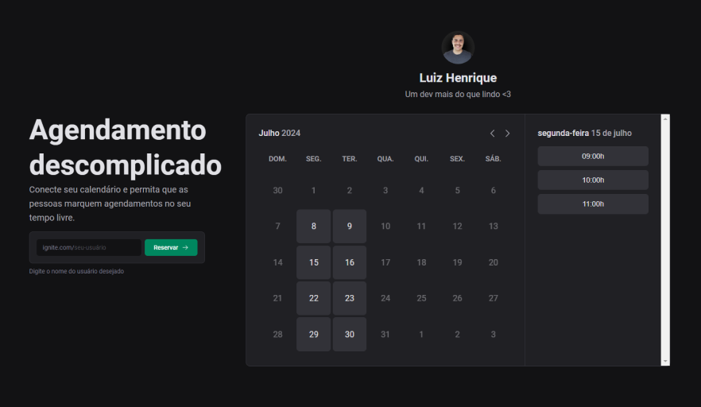

# Ignite Call

## Descrição

Este projeto vai te auxilar com agendamento de reuniões online (calls).

## Preview de como ficou

  

## Tecnologias utilizadas

- [Next.js](https://github.com/vercel/next.js) - framework para desenvolver nosso app full-stack
- [TypeScript](https://github.com/microsoft/TypeScript) - para adicionar tipagem ao nosso código javascript
- [react-hook-form](https://github.com/react-hook-form/react-hook-form) - para lidar com formulários
- [zod](https://github.com/colinhacks/zod) - para validar o formulário
- [@tanstack/react-query](https://github.com/TanStack/query) - para lidar com requisições http e melhorar a performance e usabilidade da aplicação
- [Google API](https://github.com/googleapis) - para integrar com o Google Calendar
- [Prisma](https://github.com/prisma/prisma) - orm para lidar com queries no banco de dados

## Funcionalidades

- [x] **Criar conta**
  - [x] Criar slug para conta
  - [x] Conectar ao calendário Google
  - [x] Adicionar dias e horários disponíveis na semana
  - [x] Adicionar uma biografia
- [x] **Agendar**
  - [x] Listar dias e horários disponíveis
  - [x] Formulário de confirmação com seus dados

 

Feito com 💙 por [lhmoreno](https://github.com/lhmoreno)
