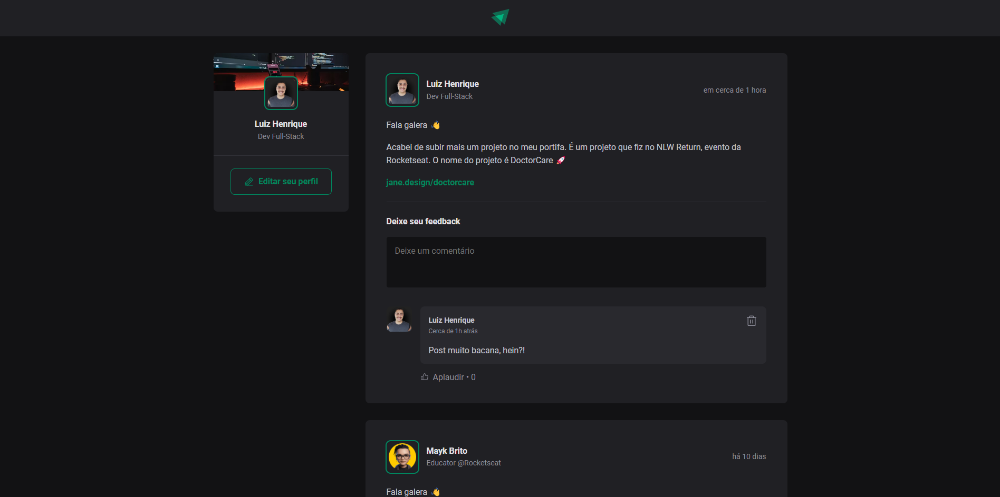

  

## Descrição

Este projeto tem o objetivo de treinar os fundamentos do ReactJS e foi desenvolvido através das aulas da Rocketseat.

## Preview de como ficou

  

## Tecnologias utilizadas

- [ReactJS](https://github.com/facebook/react) - para desenvolver o frontend web
- [Vite](https://github.com/vitejs/vite) - para configurar e otimizar nosso projeto ReactJS
- [TypeScript](https://github.com/microsoft/TypeScript) - para adicionar tipagem ao nosso código javascript
- [phosphor-react](https://github.com/phosphor-icons/react) - para adicionar icones
- [date-fns](https://github.com/date-fns/date-fns) - para lidar com datas

## Funcionalidades

- [x] **Criar comentário**
  - [x] Formulário interativo e com validação do texto inserido
- [x] **Manipulação dos comentários**
  - [x] Aplaudir comentário
  - [x] Deletar cometário

 

Feito com 💙 por [lhmoreno](https://github.com/lhmoreno)
