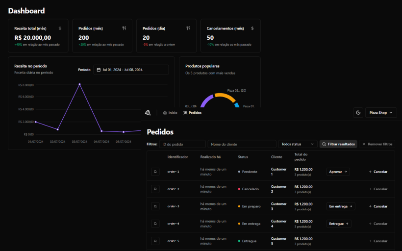

# Pizza Shop

## Descrição

Dashboard para gestão do estabelecimento e controle de pedidos estilo iFood.

## Preview de como ficou

  

## Funcionalidades

- Cadastro de estabelecimento;
- Login de estabelecimento (magic link);
- Cadastro como cliente;
- Criação de novos pedidos;
- Gestão do cardápio;
- Gestão de avaliações;
- Gestão de pedidos;
- Gestão do perfil do estabelecimento;
- Loja aberta/fechada;
- Métricas p/ dashboard;
  - Gráfico de pedidos nos últimos 15 dias;
  - Gráfico de valores nos últimos 15 dias;
  - Média de avaliações (mês/geral);
  - Média de pedidos por dia (mês/geral);
- Notificações sonoras de novos pedidos (alterar favicon);

 

Feito com 💙 por [lhmoreno](https://github.com/lhmoreno)
