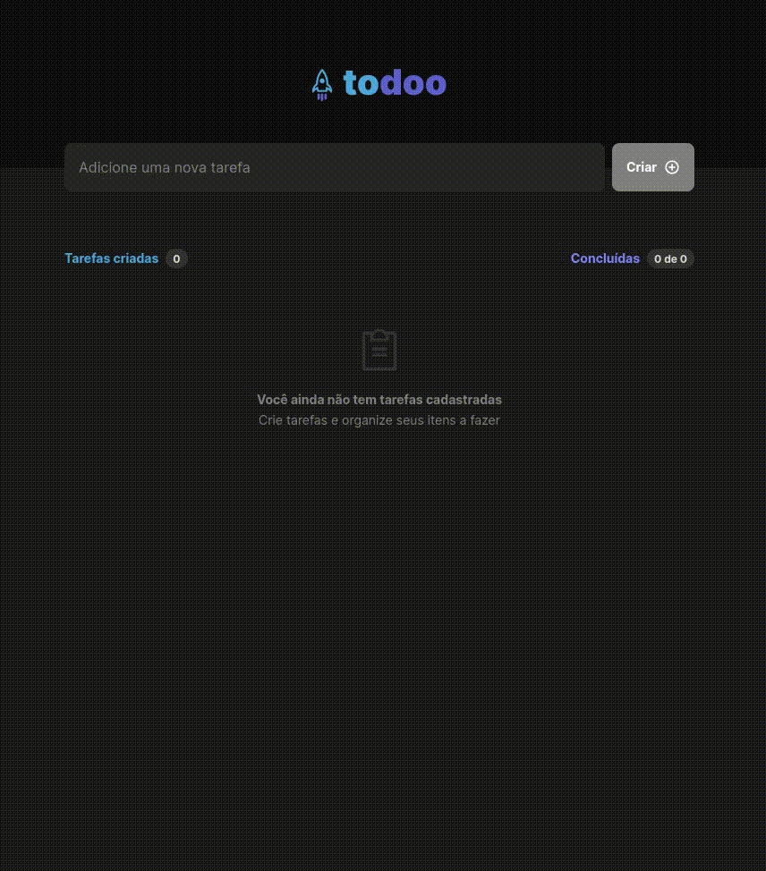

  

## Descrição

Este projeto tem o objetivo de ajudar na organização das tarefas do seu dia-dia. Utilizando o método de To-Do List é possível dar prioridade ao que é mais importante, além de ser **EXTREMAMENTE SATISFATÓRIO** concluir todas as tarefas 🔥

## Preview de como ficou

  

## Tecnologias utilizadas

- [ReactJS](https://github.com/facebook/react) - para desenvolver o frontend web
- [Vite](https://github.com/vitejs/vite) - para configurar e otimizar nosso projeto ReactJS
- [TypeScript](https://github.com/microsoft/TypeScript) - para adicionar tipagem ao nosso código javascript
- [phosphor-react](https://github.com/phosphor-icons/react) - para adicionar icones
- [uuid](https://github.com/uuidjs/uuid) - para gerar ids unicos para cada uma das tarefas
- [react-beautiful-dnd](https://github.com/atlassian/react-beautiful-dnd) - para adicionar a funcionalidade de arrastar, soltar e reordenar as tarefas

## Funcionalidades

- [x] **Criar tarefa**
  - [x] Formulário interativo e com validação do texto inserido
- [x] **Manipulação das tarefas**
  - [x] Mostrar a quantidade de tarefas criadas e concluídas
  - [x] Deletar tarefa
  - [x] Alterar a posição da tarefa usando arrasta e solta
- [x] **Persistência de dados**
  - [x] Salvar tarefas no localStorage do navegador

 

Feito com 💙 por [lhmoreno](https://github.com/lhmoreno)
